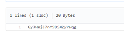
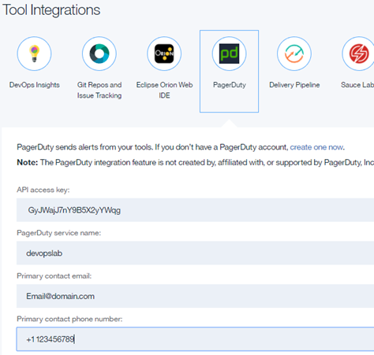

# Configure Slack Integration

# Objective
This lab show how to integrate your toolchain with Slack to collaborate with your team and receive notifications about your test and deployment activities.

## Prerequisites
You need the personal Slack ID you used in **Getting Ready for the DevTest DevOps Lab**.

**Tasks**:
- [Task 1: Configure Slack in Toolchain](#task-1-configure-slack-in-toolchain)

## Task 1: Configure Slack in Toolchain

**Note:** These steps are to be used for the **Configure Slack** steps in:

https://www.ibm.com/devops/method/tutorials/tutorial_toolchain_microservices_cd?task=1

1 In a seperate browser tab, enter the following URL: [http://ibm.biz/SlackWebhooks]http://ibm.biz/SlackWebHooks.
2. Copy the API key (the screenshot is a sample, the actual API key may be different)

2. Return to the **Create a Toolchain** bwoswer tab.
3. On the toolchain's Overview page, click **PagerDuty**.
3. On the PagerDuty Configuration page:
   - Paste the API key you just copied into the API access key field
   - Enter "devopslab" as the PagerDuty service name
   - Enter an email address you can access.  Leave the phone number blank.  PagerDuty has a place for you to enter your phone number if you want to receive text messages or receive phone calls.

4. Click **Create**
5. You can access the eMail account to accept the PagerDuty invitation.

  

6. You can enter your phone information into your PagerDuty account (if you have one).  If you do this, you will get text messages and/or phone calls, depending on where you entered your phone number.  Normal messaging rates apply.

  

  The list of countries PagerDuty supports is at: [PagerDuty Country Support](https://support.pagerduty.com/hc/en-us/articles/202828860-Countries-PagerDuty-supports-for-SMS-and-phone-call-notifications)
